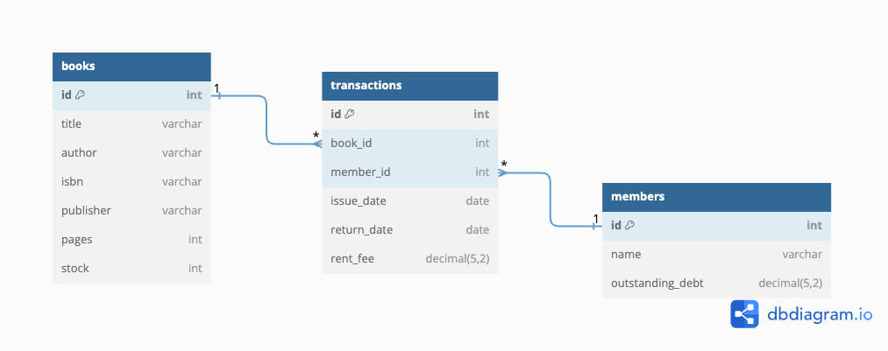

test commit
# Frappe-Library-Management-Web-Application

### Problem statement [link](https://frappe.io/dev-hiring-test)

## 💡 Main Ideas
- Page navigation kept minimal, for quick single page application like usage.
+ Instant search as you type allows fast lookup of books, Debouncing implemented to reduce api calls.
- Keep ma within Modals.

## 📺 Demo
Test Removal of Demos for Vibinex extension

## 📊 Data Design


## 📦 Libraries used
**Frontend**
- Svelte and Sveltkit
- Tailwind CSS
- Skeleton UI Toolkit for Svelte

**Backend**
- Flask
- Flask Migrate and Alembic
- SQLAlchemy

**Database**
- Postgresql

## ⚙️ Running locally
**Run in order:**

### Database (AWS RDS)
```
cd database
```
```
docker-compose up --build
```

### Backend (AWS EC2)
- URL https://16.16.156.1
- Add ```DB_URL``` env variable for database url
```
cd backend
```
```
pip install -r requirements.txt
```
```
flask db upgrade
```
```
flask run
```
### Frontend (Netlify)
- URL https://frappe-library.netlify.app
- Add ```PUBLIC_API_URL``` env variable for backend url
```
npm install
```
```
npm run dev
```
